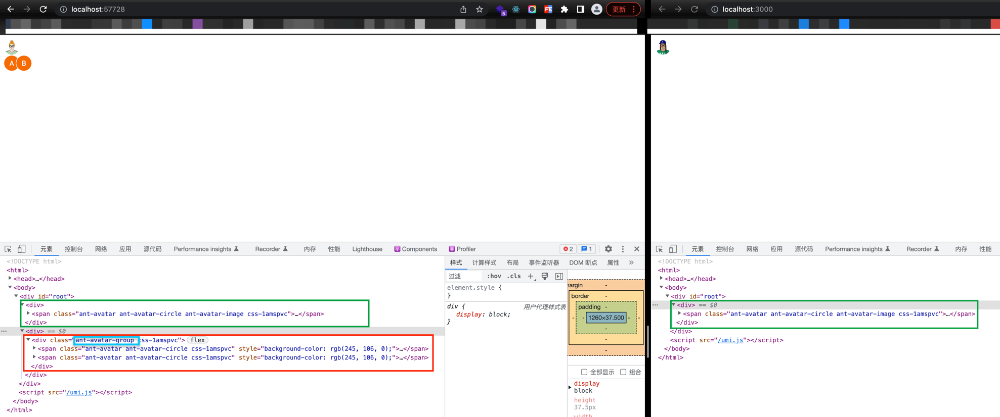
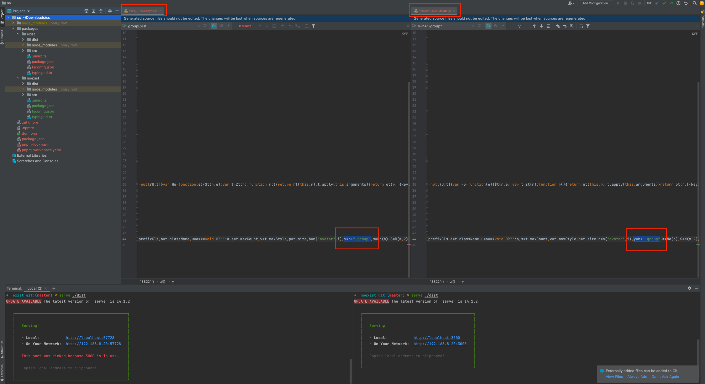

子组件挂载到父组件上导出，tree shaking 会失效。见：[avatar group](https://github.com/ant-design/ant-design/blob/master/components/avatar/index.tsx#L18) , 

证明见：
- 在 exist 的 dom 中使用了`<Avatar.Group>/>`组件，含有 `-group` 样式，属于正常。
- 在 noexist 的 dom 中未使用`<Avatar.Group>/>`组件，按理说产物不应该存在该样式。但在 `noexist/393.async.js` 却含有该样式（见 ），且加载到了浏览器。 
